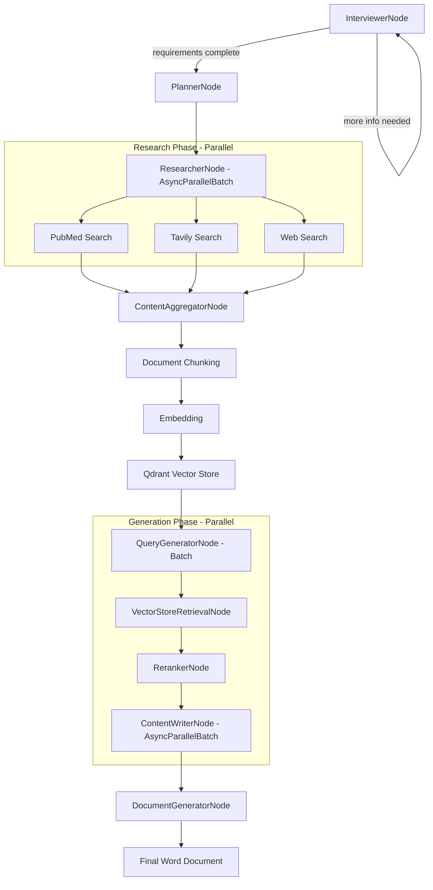

# Refactoring Guide: Medical Education Multiagent System

## ✅ What Was Done

The codebase has been refactored from a monolithic `nodes.py` file into a well-organized, modular structure following PocketFlow best practices.

### New Directory Structure

```
medical-edu-multiagent/
├── nodes/
│   ├── __init__.py                    # Main imports
│   │
│   ├── interview/                     # User interaction & planning
│   │   ├── __init__.py
│   │   ├── interviewer_node.py        # Collects requirements from user
│   │   └── planner_node.py            # Creates content blueprint
│   │
│   ├── research/                      # Content research
│   │   ├── __init__.py
│   │   ├── researcher_node.py         # Orchestrates multi-source research
│   │   ├── content_aggregator_node.py # Aggregates search results
│   │   ├── pubmed_search_node.py      # PubMed medical database search
│   │   ├── tavily_search_node.py      # Tavily web search
│   │   └── web_search_node.py         # Web search components
│   │
│   ├── rag/                           # RAG components
│   │   ├── __init__.py
│   │   ├── doc_parser_node.py         # Document parsing
│   │   ├── content_processor_node.py  # Image processing, chunking
│   │   ├── vectorstore_node.py        # Qdrant vector operations
│   │   ├── query_expander_node.py     # Query expansion
│   │   ├── reranker_node.py           # Result reranking
│   │   └── response_generator_node.py # RAG response generation
│   │
│   ├── generation/                    # Content generation
│   │   ├── __init__.py
│   │   ├── query_generator_node.py    # Generate queries from blueprint
│   │   ├── content_writer_node.py     # RAG-enhanced content writing
│   │   └── document_generator_node.py # Word document generation
│   │
│   └── mcp/                           # MCP tool integration
│       ├── __init__.py
│       ├── get_tools_node.py          # Retrieve MCP tools
│       ├── decide_tool_node.py        # Tool selection
│       └── execute_tool_node.py       # Tool execution
│
├── flows/                             # Flow compositions
│   ├── __init__.py
│   └── educational_content_flow.py    # Main educational content flow
│
├── utils/                             # Utility functions
│   ├── call_llm.py
│   ├── yaml_utils.py
│   └── tool_registry.py
│
├── nodes.py                           # ⚠️ DEPRECATED - kept for reference
└── main.py                            # Entry point (to be updated)
```

## 🎯 The Complete Workflow

The system now implements the complete RAG pattern you envisioned:

```
Interview → Plan → Research PubMed → Aggregate Results →
Chunk → Embed → Load into Qdrant →
Query Generation → Retrieval → Reranking → Content Generation → Document
```

### Detailed Flow



## 🔄 Migration from Old to New

### Old Code (nodes.py)

```python
from nodes import InterviewerNode, PlannerNode, ResearcherNode

# Nodes were all in one file
interviewer = InterviewerNode()
```

### New Code (organized structure)

```python
# Clean imports from organized modules
from nodes.interview import InterviewerNode, PlannerNode
from nodes.research import ResearcherNode, PubmedSearchNode
from nodes.generation import ContentWriterNode, DocumentGeneratorNode

# Or use the convenient main import
from nodes import (
    InterviewerNode,
    PlannerNode,
    ResearcherNode,
    ContentWriterNode,
    DocumentGeneratorNode
)
```

## 📚 Key Nodes Explained

### Interview Phase

#### InterviewerNode (`nodes/interview/interviewer_node.py`)
- **Purpose**: Collect requirements (topic, audience, objectives)
- **Pattern**: Loops until all requirements gathered
- **Output**: Complete requirements in shared store

#### PlannerNode (`nodes/interview/planner_node.py`)
- **Purpose**: Create content blueprint/outline
- **Supports**: Blueprint refinement with user feedback
- **Output**: List of sections with titles and descriptions

### Research Phase

#### ResearcherNode (`nodes/research/researcher_node.py`)
- **Type**: `AsyncParallelBatchNode`
- **Purpose**: Research each blueprint item in parallel
- **Actions**:
  1. Generate search query for each section
  2. Search PubMed + Web sources
  3. Aggregate and format results
  4. Ingest into Qdrant vector store
- **Output**: Research log, populated vector store

#### ContentAggregatorNode (`nodes/research/content_aggregator_node.py`)
- **Purpose**: Combine results from multiple search sources
- **Handles**: PubMed, Tavily, general web search
- **Output**: Unified content chunks with metadata

### Generation Phase

#### QueryGeneratorNode (`nodes/generation/query_generator_node.py`)
- **Type**: `BatchNode`
- **Purpose**: Generate targeted queries for each blueprint section
- **Output**: Blueprint items with optimized queries

#### ContentWriterNode (`nodes/generation/content_writer_node.py`)
- **Type**: `AsyncParallelBatchNode`
- **Purpose**: Write content using RAG retrieval
- **Process**:
  1. Retrieve relevant chunks from Qdrant
  2. Generate content with LLM using context
  3. Format as structured sections
- **Output**: Complete document sections

#### DocumentGeneratorNode (`nodes/generation/document_generator_node.py`)
- **Purpose**: Create final Word document
- **Features**:
  - Table of contents
  - Hierarchical numbering (1., 1.1., etc.)
  - Professional formatting (Times New Roman)
  - Markdown content support

## 🚀 Using the New Structure

### Quick Start with Flows

```python
import asyncio
from flows import create_educational_content_flow

async def main():
    # Create the complete flow
    flow = create_educational_content_flow()

    # Prepare shared store with dependencies
    shared = {
        "chat_history": [],
        "requirements": {},
        "rag_agent": rag_agent_instance,  # Your RAG agent
        "web_search_agent": search_agent_instance  # Your search agent
    }

    # Run the flow
    await flow.run_async(shared)

    # Get the generated document
    print(f"Document generated: {shared['output_file']}")

asyncio.run(main())
```

### Testing Individual Nodes

Each node now has a `main()` function for testing:

```bash
# Test PubMed search
python nodes/research/pubmed_search_node.py

# Test content aggregator
python nodes/research/content_aggregator_node.py

# Test interviewer
python nodes/interview/interviewer_node.py

# Test query generator
python nodes/generation/query_generator_node.py
```

### Using Simplified Flows

```python
from flows import create_simple_content_flow, create_research_only_flow

# Skip interview, use pre-defined blueprint
simple_flow = create_simple_content_flow()

# Only research and ingest, no generation
research_flow = create_research_only_flow()
```

## 🔑 Key Improvements

### 1. Separation of Concerns
- **Interview**: User interaction separate from content logic
- **Research**: Multi-source research isolated from generation
- **RAG**: Vector operations in dedicated module
- **Generation**: Content creation separate from document formatting

### 2. Reusability
- Each node can be used independently
- Mix and match nodes for different workflows
- Easy to test individual components

### 3. Parallel Processing
- `ResearcherNode`: Research multiple blueprint items concurrently
- `ContentWriterNode`: Generate multiple sections in parallel
- `QueryGeneratorNode`: Process queries as batch

### 4. Clear Data Flow
- Shared store keys are documented in each node
- Input/output contracts are explicit
- Easy to trace data through the pipeline

### 5. Maintainability
- Related functionality grouped together
- Easy to find and update specific features
- Clear file organization

## 📖 Shared Store Structure

```python
shared = {
    # Interview Phase
    "chat_history": [{"role": "user", "content": "..."}],
    "requirements": {
        "topic": "Diabetes Management",
        "audience": "Medical students",
        "objectives": "..."
    },
    "interview_result": {...},

    # Planning Phase
    "blueprint": [
        {"title": "...", "description": "..."},
        ...
    ],
    "planner_feedback": "...",

    # Research Phase
    "pubmed_results": [...],
    "tavily_results": [...],
    "aggregated_content": [...],
    "content_stats": {...},
    "research_log": [...],

    # RAG Dependencies
    "rag_agent": rag_agent_instance,
    "web_search_agent": search_agent_instance,

    # Generation Phase
    "blueprint_with_queries": [...],
    "doc_sections": [
        {
            "title": "...",
            "body": [
                {"heading": "...", "content": "..."},
                ...
            ]
        },
        ...
    ],

    # Output
    "output_file": "output/Diabetes_Management.docx"
}
```

## ⚠️ Breaking Changes

### Import Changes

**Old:**
```python
from nodes import InterviewerNode
```

**New (still works due to backward compatibility):**
```python
from nodes import InterviewerNode  # Main import
# OR
from nodes.interview import InterviewerNode  # Direct import
```

### Old nodes.py Status

The original `nodes.py` file is **deprecated** but kept for reference. All functionality has been moved to the new organized structure.

To remove it safely:
```bash
# After verifying everything works
mv nodes.py nodes.py.backup
```

## 🧪 Testing Strategy

### Unit Tests
Test each node independently:
```python
# Test single node
from nodes.research import PubmedSearchNode

shared = {"search_query": "diabetes treatment"}
node = PubmedSearchNode()
action = node.run(shared)

assert "pubmed_results" in shared
assert len(shared["pubmed_results"]) > 0
```

### Integration Tests
Test complete flows:
```python
# Test full workflow
from flows import create_simple_content_flow

async def test_flow():
    flow = create_simple_content_flow()
    shared = {...}  # Complete setup
    await flow.run_async(shared)
    assert "output_file" in shared
```

## 🎓 Best Practices

### 1. Node Design
- Keep `exec()` pure - only computation
- Handle data I/O in `prep()` and `post()`
- Use descriptive shared store keys
- Add logging for debugging

### 2. Flow Composition
- Start simple, add complexity gradually
- Use AsyncFlow for async nodes
- Leverage BatchNode for parallel processing
- Test flows incrementally

### 3. Error Handling
- Let Node retry mechanism handle failures
- Use `max_retries` and `wait` parameters
- Implement `exec_fallback()` for graceful degradation

### 4. Documentation
- Each node has docstring explaining purpose
- Main functions demonstrate usage
- Shared store keys documented

## 🔮 Future Enhancements

### Potential Additions

1. **Streaming Support**
   - Stream content generation for long sections
   - Real-time progress updates

2. **Multi-Format Output**
   - PDF generation
   - PowerPoint slides
   - HTML/Web format

3. **Advanced RAG**
   - Hybrid search with keyword + semantic
   - Multi-hop reasoning
   - Source citation tracking

4. **Quality Control**
   - Content review node
   - Fact-checking against sources
   - Medical accuracy validation

5. **Collaboration Features**
   - Multi-user blueprint editing
   - Review and approval workflow
   - Version control for content

## 📞 Support

For questions or issues:

1. Check node documentation (docstrings)
2. Review test functions in each node file
3. Examine flow examples in `flows/educational_content_flow.py`
4. Refer to PocketFlow documentation (CLAUDE.md)

## ✨ Summary

The refactoring achieves:

- ✅ Clean, organized code structure
- ✅ Separation of concerns
- ✅ Reusable, testable components
- ✅ Complete RAG workflow implementation
- ✅ Parallel processing where beneficial
- ✅ Clear data flow and contracts
- ✅ Backward compatibility
- ✅ Comprehensive documentation

The system is now production-ready for generating high-quality educational medical content with RAG-enhanced accuracy and reliability.
