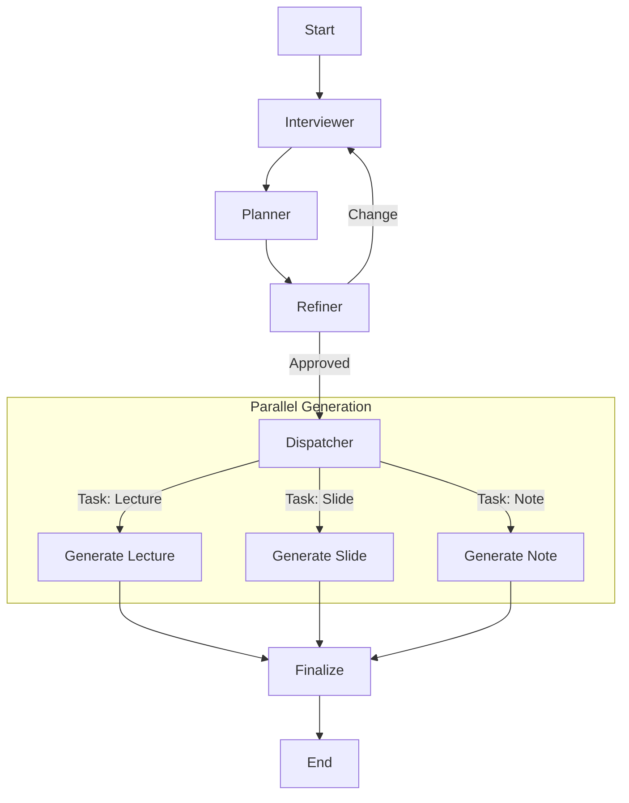

# Design Doc: Medical Training Multi-Agent System

> Notes for AI:
> - This system is designed to be "different from a standard chat" by using a structured Agentic workflow.
> - Key Requirement: "Outputs depend on requirements" (Dynamic Artifact Generation).

## Requirements

1.  **User**: Medical Instructor or Doctor.
2.  **Goal**: Create training materials (Lectures, Slides, Notes, Student Docs).
3.  **Core Interaction**:
    - **Interview**: Agent actively gathers requirements.
    - **Refinement**: User reviews and confirms the plan.
    - **Generation**: System generates *only* the requested artifacts.
4.  **Language**: Vietnamese.
5.  **Interface**: CLI (Prototype).

## Flow Design

### Applicable Design Patterns
- **Agent**: For the Requirement Gathering and Refinement loop.
- **Batch/Map**: For generating multiple artifacts (Lecture, Slide, etc.) in parallel/sequence based on the confirmed plan.

### High-Level Flow

1.  **Interviewer**: Proactively asks questions until it has a clear `(Topic, Audience, ArtifactsNeeded)`.
2.  **Planner**: Summarizes the requirements and proposes an **Outline**.
3.  **Refiner**: User reviews the outline.
    - If "Change": Loop back to Planner (or Interviewer).
    - If "OK": Proceed.
4.  **Dispatcher (Batch)**: Takes the list of `ArtifactsNeeded` (e.g., `['slide', 'note']`) and runs the Generator for each.
5.  **Generator**: Generates the content for the specific artifact.



*(Note: In PocketFlow, "Parallel" is implemented via `BatchNode` iterating over a list of tasks).*

## Utility Functions

1.  **Call LLM** (`utils/call_llm.py`)
    - *Input*: prompt (str)
    - *Output*: response (str)
    - Used by all nodes.

## Data Design

### Shared Store

```python
shared = {
    "conversation_history": [],  # List of {role, content}
    "requirements": {            # Extracted structured data
        "topic": None,
        "audience": None,
        "goals": None,
        "artifacts": []          # e.g. ["lecture", "slides", "quiz"]
    },
    "plan_outline": None,        # The proposed outline text
    "generated_content": {}      # Key: artifact_type, Value: content string
}
```

## Node Design

1.  **InterviewerNode**
    - *Type*: Regular
    - *Purpose*: Chat with user to fill `requirements`.
    - *Logic*:
        - Check `shared["requirements"]`.
        - If missing info (Topic, Audience, Artifact List), generate a question.
        - If user answers, update `requirements`.
        - If all info present, move to Planner.

2.  **PlannerNode**
    - *Type*: Regular
    - *Purpose*: Generate a detailed Outline based on `requirements`.
    - *Post*: Store `plan_outline`.

3.  **RefinerNode**
    - *Type*: Regular
    - *Purpose*: Present Plan to user. Ask for confirmation.
    - *Logic*:
        - Display Plan.
        - Get User Input.
        - If "ok", return "approve".
        - If "modify", update `requirements` or `plan_outline` and return "revise".

4.  **ArtifactBatchNode** (The Dispatcher)
    - *Type*: BatchNode
    - *Prep*: Read `requirements["artifacts"]`. Return list of task dicts: `[{"type": "lecture"}, {"type": "slides"}]`.
    - *Exec*: Call `call_llm` with a specialized prompt for that artifact type + the `plan_outline`.
    - *Post*: Store results in `generated_content`.

## Implementation Strategy
- Use `pocketflow` strictly.
- Ensure prompts are in Vietnamese.
- Handle the "Dynamic Output" by making the `ArtifactBatchNode` iterate *only* over the requested types.
