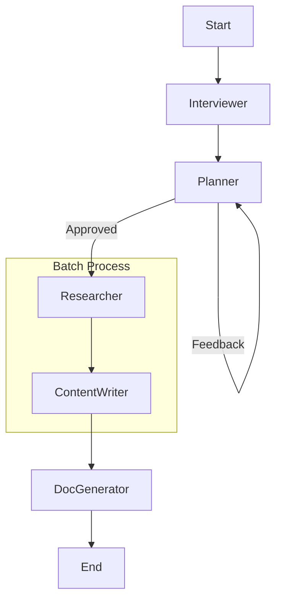

# Design Doc: Medical Training Multi-Agent System

> Notes for AI:
> - This system is designed to be "different from a standard chat" by using a structured Agentic workflow.
> - Key Requirement: "Outputs depend on requirements" (Dynamic Artifact Generation).

## Requirements

1.  **User**: Medical Instructor or Doctor.
2.  **Goal**: Create training materials (Lectures, Slides, Notes, Student Docs).
3.  **Core Interaction**:
    - **Interview**: Agent actively gathers requirements.
    - **Refinement**: User reviews and confirms the plan.
    - **Generation**: System generates *only* the requested artifacts.
4.  **Language**: Vietnamese.
5.  **Interface**: CLI (Prototype).

## Flow Design

### Applicable Design Patterns
- **Agent**: For the Requirement Gathering and Refinement loop.
- **Batch/Map**: For generating multiple artifacts (Lecture, Slide, etc.) in parallel/sequence based on the confirmed plan.

### High-Level Flow

1.  **Interviewer**: Proactively asks questions until it has a clear `(Topic, Audience, Objectives)`.
2.  **Planner**: Creates a Blueprint (Outline) based on requirements and iterates with user feedback.
3.  **Researcher (Batch)**: For each item in the blueprint, searches/retrieves relevant medical knowledge.
4.  **ContentWriter (Batch)**: For each item, writes detailed content based on research notes.
5.  **DocGenerator**: Compiles the written sections into a Word document (DOCX) with professional formatting.



*(Note: In PocketFlow, "Parallel" is implemented via `BatchNode` iterating over a list of tasks).*

## Utility Functions

1.  **Call LLM** (`utils/call_llm.py`)
    - *Input*: prompt (str)
    - *Output*: response (str)
    - Used by all nodes.

2.  **MCP Server** (`utils/mcp_server.py` & `utils/tool_registry.py`)
    - *Purpose*: Provides tools for document manipulation via Model Context Protocol.
    - *Key Tools*:
        - `create_document`: Initialize a DOCX file.
        - `add_markdown_content`: Converts Markdown (Heading `#`, Bold `**`, Lists `*`) to native Word styles.
        - `save_document`: Saves the file.

## Data Design

### Shared Store

```python
shared = {
    "chat_history": [],          # List of {role, content}
    "requirements": {            # Extracted structured data
        "topic": "...",
        "audience": "...",
        "objectives": "..."
    },
    "blueprint": [               # List of items for generation
        {"title": "...", "description": "..."}
    ],
    "research_data": [],         # List of research notes (corresponds to blueprint)
    "doc_sections": [],          # List of generated content sections
    "output_file": "path/to/file.docx"
}
```

## Node Design

1.  **InterviewerNode**
    - *Type*: Regular
    - *Purpose*: Chat with user to fill `requirements` (Topic, Audience, Objectives).

2.  **PlannerNode**
    - *Type*: Regular
    - *Purpose*: Generate or Refine a detailed Blueprint (Outline) based on `requirements` and user feedback.
    - *Output*: List of blueprint items (title, description).

3.  **ResearcherNode**
    - *Type*: BatchNode
    - *Prep*: Iterates over the blueprint items.
    - *Exec*: Generates/Finds "notes" or facts for each slide/section.
    - *Post*: Stores `research_data`.

4.  **ContentWriterNode**
    - *Type*: BatchNode
    - *Prep*: Zips `blueprint` + `research_data`.
    - *Exec*: Generates detailed content section in YAML format.
        - *Note*: Uses block scalars (`|`) for text to handle quotes safely.
    - *Post*: Stores `doc_sections`.

5.  **DocGeneratorNode**
    - *Type*: Regular
    - *Exec*:
        - Creates a new DOCX file.
        - Iterates through `doc_sections`.
        - Calls `add_markdown_content` (MCP tool) to add formatted text (Headings, Bold, Lists).
        - Saves the document.

## Implementation Strategy
- Use `pocketflow` strictly.
- Ensure prompts are in Vietnamese.
- Handle the "Dynamic Output" by making the `ArtifactBatchNode` iterate *only* over the requested types.
